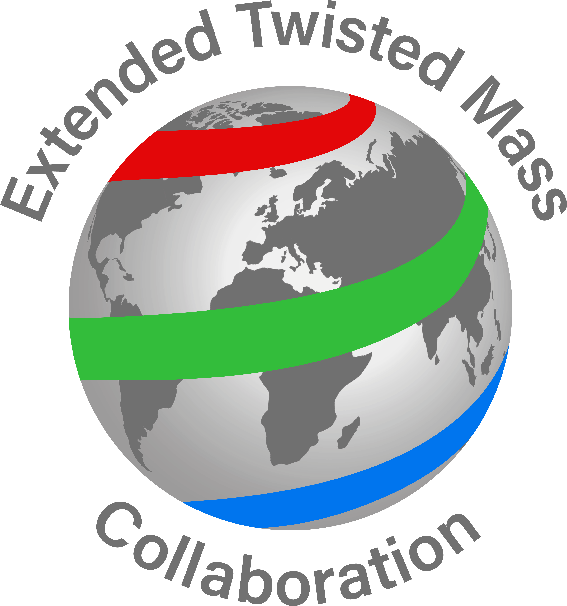

Collaborations
==============

The lattice QCD community in Europe is comprised of several collaborations, as well as smaller groups.
Together they are part of an international research effort, and many of the larger collaborations have
participating researchers from outside Europe. Major collaborations are :ref:`ALPHA <ALPHA>`,
:ref:`BMW <BMW>`, :ref:`CLS <CLS>`, :ref:`ETMC <ETMC>`, :ref:`HotQCD <HotQCD>`, :ref:`QCDSF <QCDSF>`,
and :ref:`UKQCD <UKQCD>`, each with its own simulation and analysis codes. The community has a long
history in working together in coordinated, EU funded research programs. The first such program was the
European Community Network “Computational Particle Physics” (1993-1997). Currently members of the
lattice QCD community coordinate the European Network for Particle Physics, Lattice Field Theory and
Extreme Computing (EurPLEx), and participate in a number of EU projects, including STRONG-2020 funded
under the European Integrating Activity for Advanced Community initiative.

.. image:: https://www-zeuthen.desy.de/alpha/alpha_color_60.gif
   :width: 20 %
   :alt: ALPHA
   :align: left
   :target: https://www-zeuthen.desy.de/alpha/
   :class: logo-before-title

ALPHA
-----

| **Website**: https://www-zeuthen.desy.de/alpha/
| **Spokeman**: `Dr. Rainer Sommer <https://nic.desy.de/members/index_eng.html>`_
| **Institutions**:  :ref:`DESY <DESY>`, `others <https://www-zeuthen.desy.de/alpha/people.html>`_
  
The ALPHA collaboration is a consortium of theoretical physicists interested in lattice QCD
and numerical simulations. The name of the collaboration derives from the symbol given to
running couplings in QCD.

BMW
---

**Budapest-Marseille-Wuppertal Collaboration**

| **Website**: http://www.bmw.uni-wuppertal.de
| **Spokeman**: `Prof. Zoltan Fodor <http://particle.uni-wuppertal.de/fodor/>`_
| **Institutions**:  University of Wuppertal, Eötvös University, :ref:`DESY <DESY>`
|

CLS
---

**Coordinated Lattice Simulations**

| **Website**: https://twiki.cern.ch/twiki/bin/view/CLS/WebIntro
| **Spokeman**: Ulli Wolff
| **Institutions**:  Berlin, CERN, :ref:`DESY <DESY>`, `others <https://twiki.cern.ch/twiki/bin/view/CLS/WebIntro>`_

The CLS is a community effort, launched in 2007, whose aim is to bring together the human and computer resources of several teams in Europe interested in lattice QCD.

ETMC
----

**Extended Twisted Mass Collaboration**

| **Website**: https://www-zeuthen.desy.de/~kjansen/etmc/
| **Spokeman**: `Dr. K. Jansen <https://www-zeuthen.desy.de/~kjansen/>`_
| **Institutions**:  :ref:`DESY <DESY>`, :ref:`The Cyprus Institute <The Cyprus Institute>`, :ref:`University of Bonn <University of Bonn>`, :ref:`University of Cyprus <University of Cyprus>`,
  
The Extended Twisted Mass collaboration
is an international effort for Lattice QCD simulations using twisted mass fermions.

HotQCD
------

| **Reference**: http://inspirehep.net/record/1343793
|
|
|

UKQCD
-----

| **Website:** http://pyweb.swan.ac.uk/~allton/ukqcd/web/information.html
| **Institutions:** Cambridge, Edinburgh, Glasgow, Liverpool, Oxford, Plymouth, Southampton, Swansea
